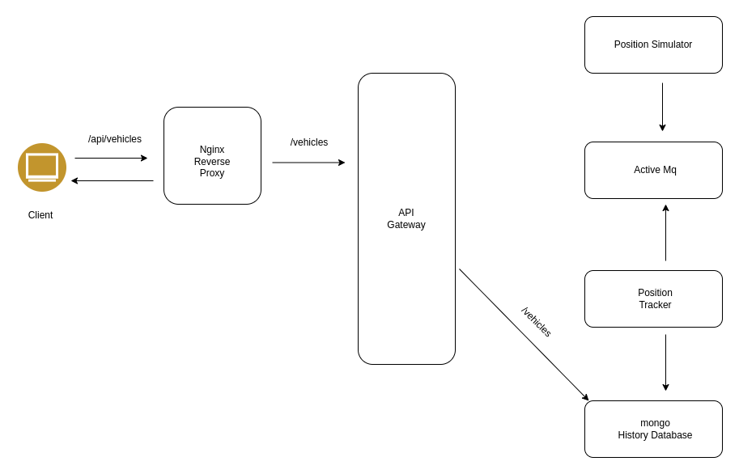

# FleetMan web application

Application developed in Java spring boot on the backend and Angular js on the frontend

## Architecture used:



deployment done in kubernetes

## Managing production level kubernetes

### Kops
**pros**
* Kops is well respected and heavily used
* it's easy to use

**cons**
* You are responsible for managing the master node
* By default you get only a single master node
* it feels like more work than EKS

### EKS
**pros**
* it has gained a lot of ground recently
* using eksctl, it is quite simple to use
* No management of the master required

**cons**
* it needs a third party tool to make it usable
* The GUI is (time of writing this) very poor, usage of cli is better
* might feel like you're tied to AWS


## Advanced topics in k8s

#### Resource Request and limits

Used in defining the amount of CPU and memory resources that a container requires. These settings play a crucial role in the scheduling and resource allocation of pods.

example
 ```
  resources:
  requests:
    memory: "64Mi"
    cpu: "250m"
  limits:
    memory: "128Mi"
    cpu: "500m"
 ```


#### Horizontal pod autoscaling

Horizontal Pod Scaling allows you to automatically scale the number of pods in a deployment based on observed CPU utilization or other custom metrics. To enable horizontal pod scaling, you can modify the deployment definition.

```
apiVersion: autoscaling/v1
kind: HorizontalPodAutoscaler
metadata:
  name: webapp-autoscaler
spec:
  scaleTargetRef:
    apiVersion: apps/v1
    kind: Deployment
    name: webapp
  minReplicas: 2
  maxReplicas: 5
  targetCPUUtilizationPercentage: 50
```

This example sets up a Horizontal Pod Autoscaler for the webapp deployment, targeting 50% CPU utilization. It will scale the number of replicas between 2 and 5 based on observed CPU usage.

#### Liveness and readiness probes

Liveness and readiness probes help Kubernetes determine the health and availability of a pod.
Let's add liveness and readiness probes to the webapp deployment:

```
  livenessProbe:
    httpGet:
      path: /health
      port: 8080
    initialDelaySeconds: 30
    periodSeconds: 10
  readinessProbe:
    httpGet:
      path: /readiness
      port: 8080
    initialDelaySeconds: 5
    periodSeconds: 5        
```

In this example, a liveness probe checks the /health endpoint every 10 seconds, starting 30 seconds after the container starts. If the probe fails, Kubernetes will restart the container.

The readiness probe checks the /readiness endpoint every 5 seconds, starting 5 seconds after the container starts. If the readiness probe fails, the pod is temporarily marked as not ready, preventing it from receiving traffic until it passes again.

* Role based access controls
* configMap and secrets
* ingress control
* jobs, Daemonsets and stateful sets
* CI/CD
