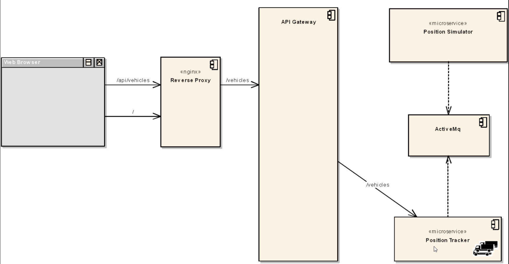

# FleetMan web application

Application developed in Java spring boot on the backend and Angular js on the frontend

## Architecture used:

deployment done in kubernetes

## Managing production level kubernetes

### Kops
**pros**
* Kops is well respected and heavily used
* it's easy to use

**cons**
* You are responsible for managing the master node
* By default you get only a single master node
* it feels like more work than EKS

### EKS
**pros**
* it has gained a lot of ground recently
* using eksctl, it is quite simple to use
* No management of the master required

**cons**
* it needs a third party tool to make it usable
* The GUI is (time of writing this) very poor, usage of cli is better
* might feel like you're tied to AWS

